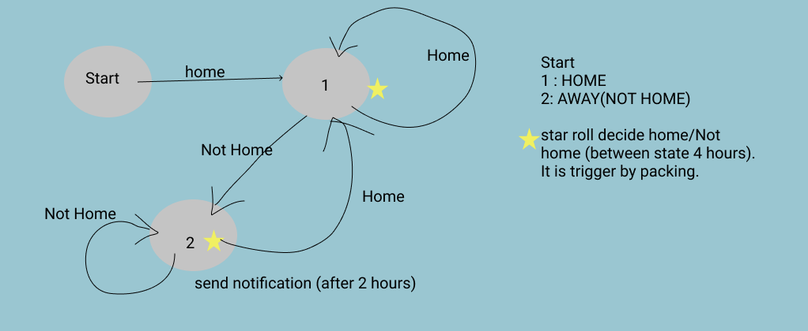
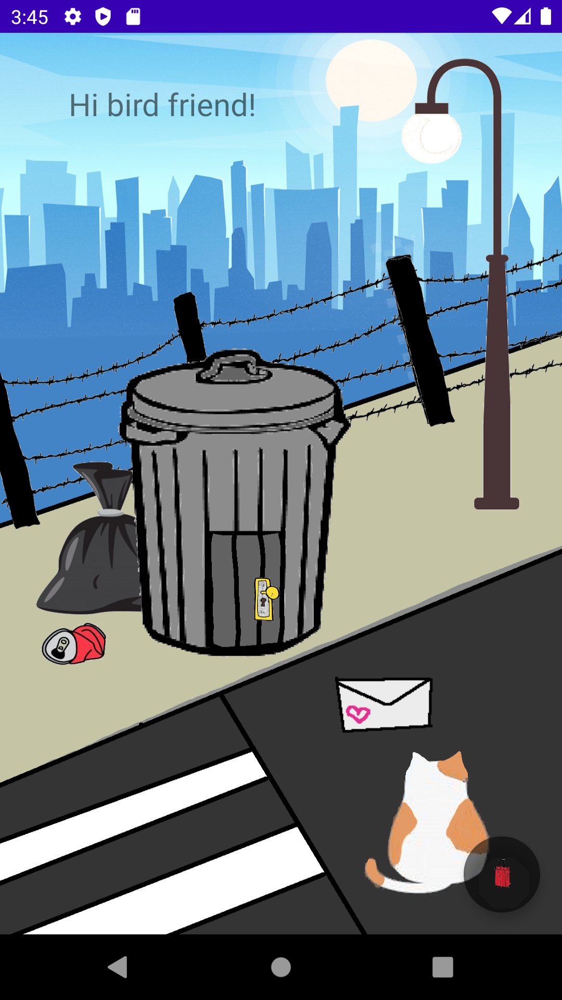
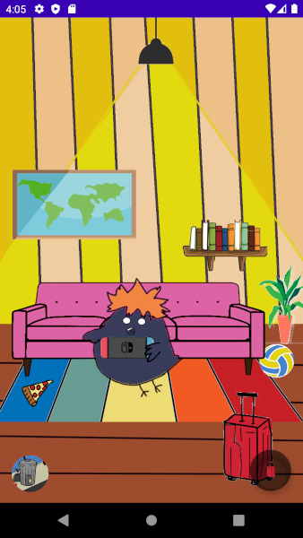
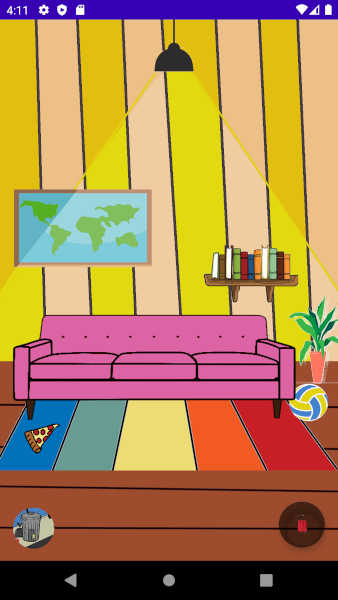
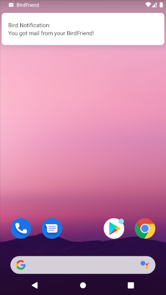
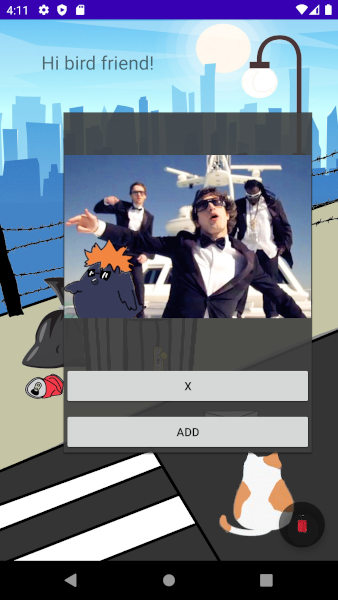
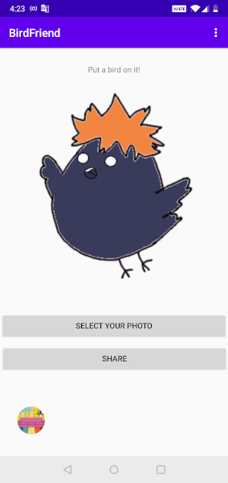
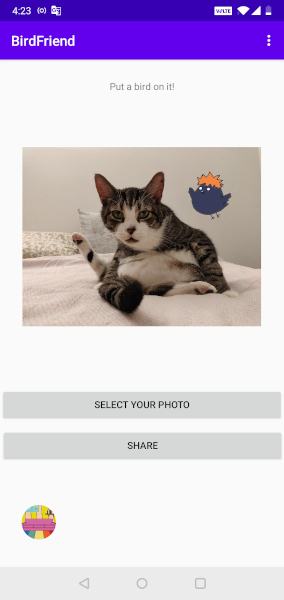
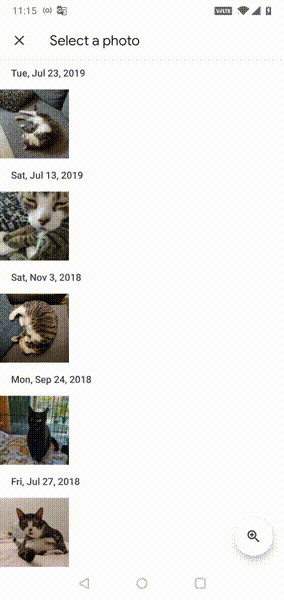
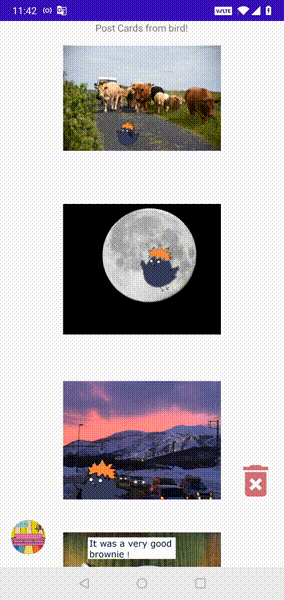

# BirdFriend
> BirdFriend is an Android app inspired by "Tabikaeru" - a mobile game about a travelling frog. Bird himself is inspried by "Haikyuu" - a volleyball sports anime. 

> Bird is either home or away, while bird is away, he will send users post cards (notifications) about his adventures.

> Tech Stack: Kotlin and Android SDK

## Main ⭐️⭐️⭐️ Features

    ⭐️ Notifications of post cards from bird
    ⭐️ Put a bird on it (user's own photo)
    ⭐️ Share post card and photo to instagram or other apps


## Table of Contents
- [Kotlin and Android SDK ](#kotlin-and-android-sdk)
- [App Features](#app-features)
- [FAQ](#faq)


## Kotlin and Android SDK 

- [WorkManager](#workmanager)
- [Room Database](#room-database)
- [NotificationCompat](#notificationcompat)
- [Bitmap and Canvas](#bitmap-and-canvas)
- [Intent](#intent)
- [AnimationDrawable](#animationdrawable)
- [Permission](#permission)

## WorkManager
> WorkManger was used to schedule tasks on logging bird's latest status of home or away to log_state_table. And if away it will also queue for adding a new post card to trigger notification for users by changing image status to TRUE. Two OneTimeWorkRequest are triggered when user click on packing luggage with a delay of 1 to 2 hours. 

1. HomeAwayWorker - will randomly assign Home or Away to database with timestamp 
2. AddPostWorker - if away from above, it will schedul adding new post card to database and send notification to users



Dependencies added for Work to build.gradle
```shell
    def work_version = "2.3.4"

    // (Java only)
    implementation "androidx.work:work-runtime:$work_version"

    // Kotlin + coroutines
    implementation "androidx.work:work-runtime-ktx:$work_version"
```
## Room Database
> Room database was used to create user_cards_table and log_state_table (for local storage). 3 main components of room: Entity, Dao and Database. 


Dependencies added for Room to build.gradle
```shell
def room_version = "2.2.5"

    implementation "androidx.room:room-runtime:$room_version"
    kapt "androidx.room:room-compiler:$room_version"

    // optional - Kotlin Extensions and Coroutines support for Room
    implementation "androidx.room:room-ktx:$room_version"

    // optional - RxJava support for Room
    implementation "androidx.room:room-rxjava2:$room_version"

    // optional - Guava support for Room, including Optional and ListenableFuture
    implementation "androidx.room:room-guava:$room_version"

    // Test helpers
    testImplementation "androidx.room:room-testing:$room_version"
```

## NotificationCompat
> NotificationCompat APIs was used to set up notification to inform users of new post card from bird! 

Dependencies added for Work to build.gradle
```shell
    //noinspection GradleCompatible
    implementation "com.android.support:support-compat:28.0.0"
```

## Bitmap and Canvas
> The task of adding a bird's image on top of a user's photo requires some image manipulation and media storage of user's phone

1. Create empty Bitmap and Canvas to draw user's image and bird image
2. When user selects a photo, use ImageDecoder to transform image to Bitmap and draw on copy of created Bitmap
3. Transform drawable bird image into bitmap and draw on canvas 
4. In order to share to external app, the new image of bird and user's image requires storage to MediaStore.Images.Media


## Intent 
> Intent was used to share post cards to other apps (Instagram, messages etc.) It was also used to access user's photo

Example code
```shell
    shareButton.setOnClickListener{
      var imageName = card.imgname
      val imageURI = Uri.parse("android.resource://com.example.birdfriend/"+resourceID)

      val sendIntent: Intent = Intent().apply {
          action = Intent.ACTION_SEND
          putExtra(Intent.EXTRA_STREAM, imageURI)
          putExtra(Intent.EXTRA_TEXT, "My bird friend went on an adventure today! $imageName")
          type = "image/jpg"
      }
      val shareIntent = Intent.createChooser(sendIntent, "Send your image:")
      startActivity(shareIntent)
  }
```


## AnimationDrawable
> AnimationDrawable was used to create frame-by-frame animations of bird. 

Example animation xml file in drawable folder

```shell
<?xml version="1.0" encoding="utf-8"?>
<animation-list xmlns:android="http://schemas.android.com/apk/res/android">

    <item android:drawable="@drawable/fly_p1"
        android:duration="200"/>
    <item android:drawable="@drawable/fly_p2"
        android:duration="200"/>
    <item android:drawable="@drawable/fly_p3"
        android:duration="200"/>

</animation-list>
```


## Permission

> Manifest.permission was used to access exteranl photo of user's for bird and user image process. 

Add following to AnroidManifest.xml
```shell
    <uses-permission android:name="android.permission.CAMERA"/>
    <uses-permission android:name="android.permission.WRITE_EXTERNAL_STORAGE"/>
```
---

## App Features 

### Overview 

App View | Actions|
--- | :--- | 
 | <ul><li>Home Page</li><li>Click on door to enter bird's house</li><li>Click on letter for new post card from bird [Notifications](#notificationcompat)</li></ul>| 
| <ul><li>Inside House Page</li><li>Click on red luggage to pack for bird and set for home or away [WorkManager](#workmanager)</li><li>Click on letter for new post card from bird [Notifications](#notification-of-post-cards)</li></ul>| 
 | <ul><li>Home or Away is determined by [WorkManager's](#workmanager) latest logged status</li><li>When Away, workmanager will schedule task of adding new post card to database which will send new notification</li></ul>|

### Notification of post cards 

- Notifications of post cards from bird is triggered by scheduled task from [WorkManager](#workmanager)
- Notification is only sent when bird's latest status is away and with new post card added to database (logged by workManager with status FALSE)
- Once clicked on Add, post card's status will be flagged to TRUE which will show up in post cards collections and disappear from mail box

|| 
--- | :--- | 


### Put a bird on it

- Users can access their own photos when click on select your photos 
- Once photo is selected, the bird will show up on the selected photo (see [Bitmap and Canvas](#bitmap-and-canvas)) 
- User can click on share to share their new photo with bird on it (see [Intent](#intent))

| |
--- | :--- | 

---

### Demo

#### Put a bird on it


#### Post Cards


---

## FAQ

- **Why did I code BirdFriend?**
    - BirdFriend is a Capstone project I worked on during Ada Developers Academy Cohort 13! (3 weeks project July 2020)

- **What is cool about this app?**
    - Bird decides to go on trips on his own. As a user, we can only wait and be surprised by his new post card in the mail! 

- **What is the hardest part of this project for me?**
    - Setting up bird's home or away status from backend. I used the WorkManager to queue for work request on logging bird's latest new status of away or home (see [WorkManager](#workmanager))
    - Adding bird's image to user's photo and sharing it to other apps (see [Bitmap and Canvas](#bitmap-and-canvas)). 

- **What you learned?**
    - Kotlin! And it is very fun to create an App 
