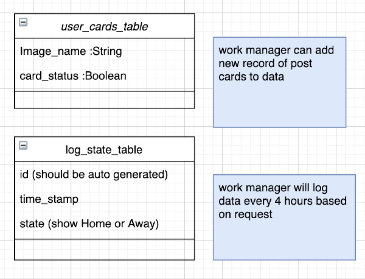

# BirdFriend
> BirdFriend is an Android app inspired by "Tabikaeru" - a mobile game about a travelling frog. Bird himself is inspried by "Haikyuu" - a volleyball sports anime. 

> Bird is either home or away, while bird is away, he will send users post cards (notifications) about his adventures.

> Tech Stack: Kotlin and Android SDK

<!--  -->

## App Features 

- Notifications of post cards from bird
- Put a bird on it (user's own photo)
- Share post card and photo to instagram or other apps 


## Kotlin Tech Highlights 

- [WorkManager](#workmanager)
- [Room](#room)
- [NotificationCompat](#notificationcompat)
- [Intent](#intent)
- [AnimationDrawable](#animationdrawable)
- [Bitmap and Canvas](#bitmap)
- [Permission](#permission)


## WorkManager
## Room
> Room database stored user_cards_table and log_state_table (local storage)



- Entity
- Dao
- Database

## NotificationCompat
> NotificationCompat APIs was used to set up notification for new post cards in mail box. 

## Intent 
> Intent was used to share data to external of App

## AnimationDrawable
> AnimationDrawable was used to create frame-by-frame animations of bird. 

## Bitmap

## Permission

> Manifest.permission was used to access exteranl photo of user's for bird and user image process. 

Add following to AnroidManifest.xml
```shell
    <uses-permission android:name="android.permission.CAMERA"/>
    <uses-permission android:name="android.permission.WRITE_EXTERNAL_STORAGE"/>
```
---

## FAQ

- **Why did I code BirdFriend?**
    - BirdFriend is a Capstone project I worked on during Ada Developers Academy Cohort 13! (3 weeks project July 2020)

- **What is the hardest part of this project for me?**
    - Setting up bird's home or away status from backend. I used the WorkManager to queue for work request on logging bird's latest new status of away or home (see [WorkManager](#workmanager))

- **What you learned?**
    - Kotlin! And it is very fun to create an App 
