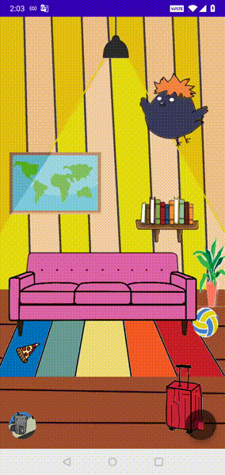

# BirdFriend
> BirdFriend is an Android app inspired by "Tabikaeru" - a mobile game about a travelling frog. Bird himself is inspried by "Haikyuu" - a volleyball sports anime. 

> Bird is either home or away, while bird is away, he will send users post cards (notifications) about his adventures.

> Tech Stack: Kotlin

